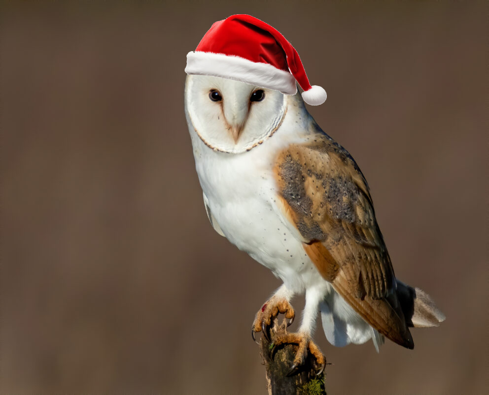

# hi hello, good meeting thee

this is my profile and it's definitely a sight to behold. if you ever have the displeasure of meeting me in real life, please give me high fantasy books, and Milk Tea or Coffee (Black is fine, albeit a tad 苦い)

## languages I know

<a href="https://github.com/anuraghazra/github-readme-stats" target="_blank">
    <picture align="right" title="Top Langs">
      <source media="(prefers-color-scheme: dark)" srcset="https://github-readme-stats.vercel.app/api/top-langs?username=burdenowl&theme=one_dark_pro&layout=compact" alt="Top Langs" />
      <source media="(prefers-color-scheme: light)" srcset="https://github-readme-stats.vercel.app/api/top-langs?username=burdenowl&theme=default&layout=compact" alt="Top Langs" />
      
    </picture>
</a>

I know JS (Currently learning TS because of suicidal thoughts arising), CSS, HTML, and a wee tad bit of Python (when I mean "wee tad bit", I mean infinitesimal)

If my code looks a tad yucky, that's because I am currently relearning it (I shall forever say this even when I can code somewhat well)

## facts about me

socially brain dead.

former (and probably still) always nester.

knows three languages (like real languages) and aspires to learn 5.

will most likely get glasses in 6 months. 

can code for 6 hours straight without getting anything accomplished. 

よろしくお願いします。
